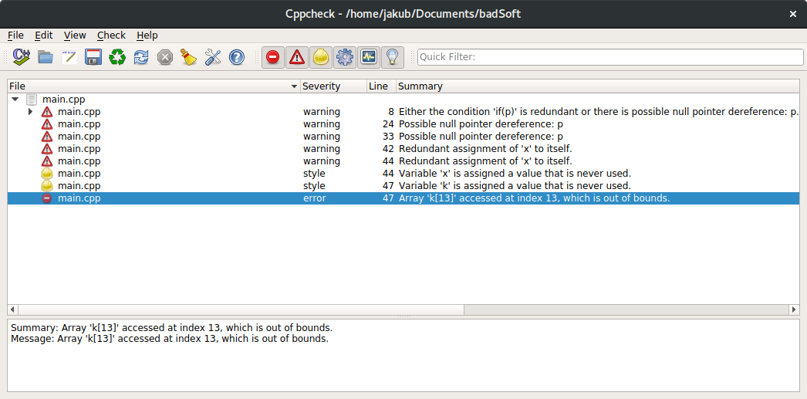
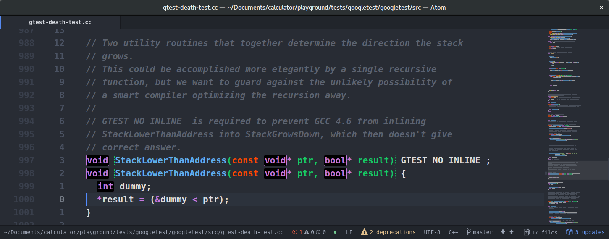

---?image=assets/image/jeremy-bishop.jpg

# Static Analysis

@fa[arrows gp-tip](Press F to go Fullscreen)

---?image=assets/image/kyle-gregory-devaras.jpg

# Definition

- Static program analysis is the analysis of computer software
that is performed without actually executing programs
- Analysis performed on executing programs is known as dynamic analysis |
- In most cases the analysis is performed on some version of the source code |

---?image=assets/image/kyle-gregory-devaras.jpg

## Tools

- CppCheck an CppCheck-gui (GPL)
- SonarCube (LGPL)
- Coverity (commercial)

---?image=assets/image/kyle-gregory-devaras.jpg

## CppCheck GUI

---?image=assets/image/john-reign-abarintos.jpg

## CppCheck GUI

---?image=assets/image/john-reign-abarintos.jpg

## SonarCube

- Scanner / Server architecture
- plugin based
- Official C++ plugin is comercial but other languages are for free
- there is a community c++ plugin

---?image=assets/image/john-reign-abarintos.jpg

---?image=assets/image/kyle-gregory-devaras.jpg

---?image=assets/image/kyle-gregory-devaras.jpg

---?image=assets/image/kyle-gregory-devaras.jpg

---?image=assets/image/kyle-gregory-devaras.jpg

---?image=assets/image/kyle-gregory-devaras.jpg
